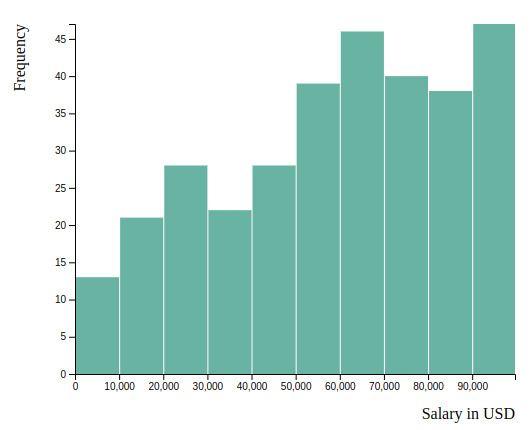

# Visualisation Final Project Elizaveta Zaburunova

Documentation:
Aim
Description of dataset
Code description: Explain the overview of what exactly you are doing
Results: Overview of your results, description of your results with screen shots, your findings through visualisation & Interaction and so on

## Aim

This project is based on survey data from from [ai-jobs.net](https://salaries.ai-jobs.net/download/). \
We want to enable the user to engage with the data to better understand _where_ the greatest demand
for jobs _AI_ exist, how much they pay and what kind of roles are in demand.

## Description of dataset

Overview over the all the available variables from the dataset. Variables in bold were used for the visualisation. The authors of the dataset that also conducted the
survey added a column that shows the salary in USD which makes the comparison for each country easier. Overal the dataset contains 733 respondings from survey participants.

| Variable             | Description                                                                                                                                                                                    |
| -------------------- | ---------------------------------------------------------------------------------------------------------------------------------------------------------------------------------------------- |
| work_year            | The year the salary was paid.                                                                                                                                                                  |
| experience_level     | The experience level in the job during the year with the following possible values: EN Entry-level / Junior MI Mid-level / Intermediate SE Senior-level / Expert EX Executive-level / Director |
| employment_type      | The type of employment for the role: PT Part-time FT Full-time CT Contract FL Freelance                                                                                                        |
| **job_title**        | **The role worked during the year.**                                                                                                                                                           |
| salary               | The total gross salary amount paid.                                                                                                                                                            |
| salary_currency      | The currency of the salary paid as an ISO 4217 currency code.                                                                                                                                  |
| **Salary in usd**    | **The salary in USD (FX rate divided by avg. USD rate for the respective year via fxdata.foorilla.com).**                                                                                      |
| employee_residence   | Employee's primary country of residence during the work year as an ISO 3166 country code.                                                                                                      |
| remote_ratio         | The overall amount of work done remotely, possible values are as follows: 0 No remote work (less than 20%) 50 Partially remote 100 Fully remote (more than 80%)                                |
| **company_location** | **The country of the employer's main office or contracting branch as an ISO 3166 country code.**                                                                                               |
| company_size         | The average number of people that worked for the company during the year: S less than 50 employees (small) M 50 to 250 employees (medium) L more than 250 employees (large)                    |

One problem that comes with using this dataset is, that the majority of respondends was coming from the US with only a few observations coming from the rest of the world.
Although the authors state, that they cleaned and prepared the dataset we can clearly see that there are some very uncommon outliers e.g. in russia with one response stating
an income of USD 800,000. This outlier was manually removed in order to prevent distortion of the scales.

## Code description

### Project structure

- `data/`:
  - Contains the salary dataset in .csv format and the information about the countries in a GeoJSON format
- `scripts/`:
  - `map.js`: Includes the code for the (1) Map (2) Histogram and (3) Top-10 job roles. It also handles all of the interactivity in form of callback functions that redraw the chart witht the updated data or selected country.
  - `barchart.js`: Contains the code for the barchart with muti-select. Handles the interactivity for the multi-select events and redrawing of the chart.
  - `iso3to4.js`:
- `index.html`: Loads all javascript dependencies in the right order, defines placeholder elements in the DOM and loads our custom scripts.
- `Documentation.md`:
  - This file. Contains the documentation and overview of the project.
- `assets/`:
  - Contains screenshots used in the documentation

### Libraries used

- [D3.js](https://github.com/d3/d3/tree/4) in version 4
- Generating the color scale with: [d3-scale-chromatic](https://github.com/d3/d3-scale-chromatic)
- Computing projections for visualisiong the GeoJSON: [d3-geo-projection](https://github.com/d3/d3-geo-projection)
- Polyfill so that `d3.rollup` can be used D3v4: [d3-array](https://github.com/d3/d3-array)
- Convert country IDS: [vtex/country-iso-2-to-3](https://github.com/vtex/country-iso-2-to-3)

## Results

### Choropleth Map

This visualisation allows gives the user an overview over all countries and shows the user based on a color scale the mean salary per country. Coloring the
countries in a gradient allows for easy visual comparison between the countries, the darker the blue gets the higher is the mean income for AI jobs.
Computing the mean value was achieved using a combination of `d3.nest`, `d3.key` to combine each country and `d3.rollup` to compute the mean per key.
The color scale is based on a `d3.linearScale` where the lower end is the country with the smalles mean salary and the upper end is defined trough the maximum
mean salary in the dataset.

**Interactivity**

- Hovering over the country highlights each country. It changes the CSS so that the country the mouse is currently over is highlighted
  and the oppacity for other countries gets reduced.
- Clicking the country selects the country for and changes all of the following visualisations

The map was visualised based on a [GeoJSON dataset](https://raw.githubusercontent.com/holtzy/D3-graph-gallery/master/DATA/world.geojson) that describes each
country shape as a multipolygon.
Country IDs in the GeoJSON dataset contained the _ISO 3166-1 Alpha-3_ format, the salary dataset contains the country IDs in _ISO 3166-1 Alpha-2_ format.
In order to convert between the two, a library was adapted to make this possible. [vtex/country-iso-2-to-3](https://github.com/vtex/country-iso-2-to-3) allows the
conversion from two letter IDs to three letter IDs, the library was adapted so that we can do the inverse translation i.e. from three letter IDs to two letter IDs.

### Histogram

Having the mean salary is not very expresive for this exploratory data analysis. For that reason, a histogram was added that allows the user to
see how the salary is distributed in each country. Computing the histogram was done using the built-in function `d3.histogram` with _10_ as the static number
of bins. If no country was clicked on map, the chart shows the histogram for all the available countries in the dataset.

**Interactivity**

- When the user clicks on a different country on the map this chart gets updated
- Hovering over each bar shows a tooltip that describes how many jobs are in between two salary ranges

### Top-10 job roles

Searching for jobs also involves searching for the right role. That is why we added a barplot that shows the top-10 (or less if there are not enough samples)
job roles in each country. This visualisation offers the same interactivity like the histogram plot, if no country is selected it shows the top-10 job roles in _AI_
for all the available countries in the dataset.

**Interactivity**

- When the user clicks on a different country on the map this chart gets updated
- For additional interactivity we added hover tooltips when moving the mouse over the visualisation

### Barchart country comparison

In order to compare two or more countries directly, a visualisation was added where the user can select _n_ countries from a multi-select box. The selection
can be done using native multi-select tools. _CTRL+Click_ selects multiple counties. _SHIFT+Click_ selects all countries in between. If no countries are selected
all countries that are available in the dataset are selected.

**Interactivity**

- The chart gets updated when the user changes the selection of the multi-select box
- Similar to the Top-10 job roles an interactive hover tooltip was added that allows the user to more easily investigate single bars by moving the mouse over them.

